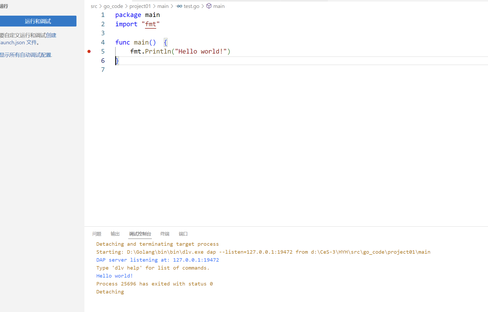
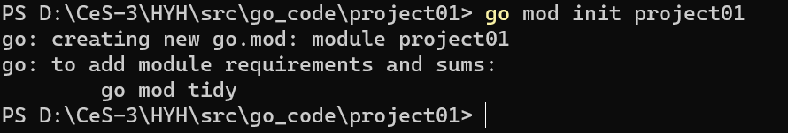
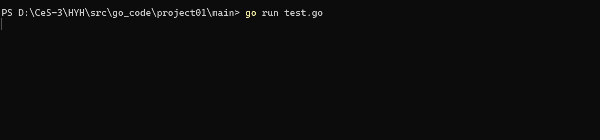
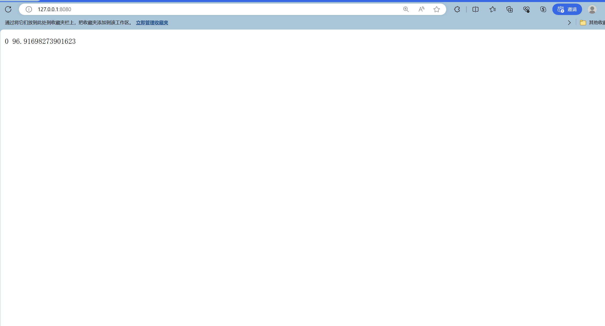
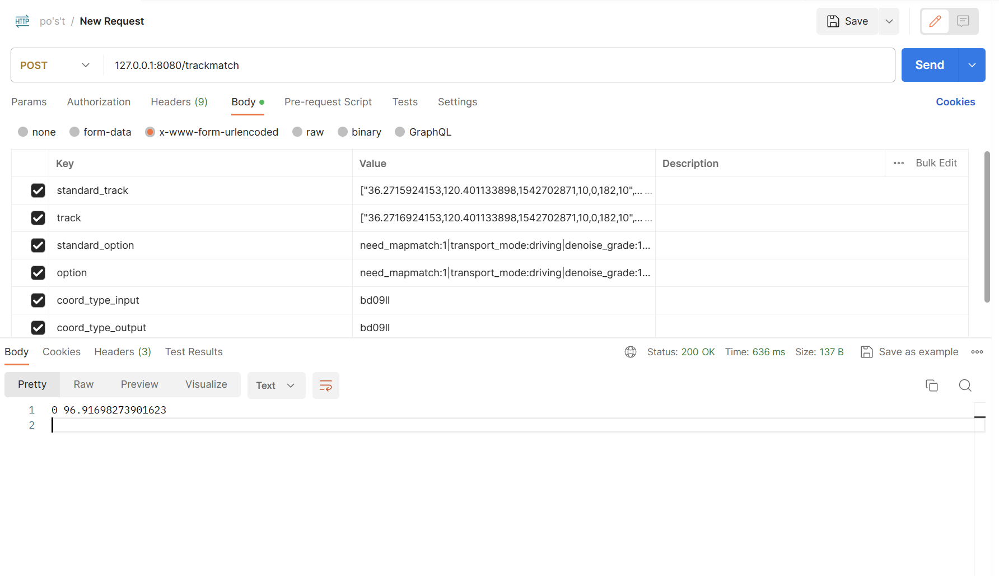

# Day 1:
先了解了一下Go语言的相关背景知识，发现它跟C语言渊源还挺深，给人第一感觉就像是C语言和python语言结合产生的。  
先配了个Go语言的开发环境，使用vscode，安装go的相关插件，添加了环境变量，插件很贴心地下载了很多工具  
目前开发环境拥有基本的代码高亮，自动补充与调试功能。  
写了个测试程序，运行结果如下：
  
期间也遇上了不少问题，但其中最突出的一个还是刚写完程序提示错误  
    
    gopls was not able to find modules in your workspace.

    When outside of GOPATH, gopls needs to know which modules you are working on.

    You can fix this by opening your workspace to a folder inside a Go module, or

    by using a go.work file to specify multiple modules.

    See the documentation for more information on setting up your workspace
还挺让人不解的。  
之后经过搜索发现这涉及一个golang 1.11 新加的go modules特性，要在工作区中设置一个go.mod文件来指定工作区范围。编程小白世面见得确实少。根据资料使用go mod 命令解决问题。  
  

# Day 2:
上一天课。  
真该死啊，计网实验课  

# Day 3:
简单看了一下Go的语法，光看还是没什么用    
干脆直接上手  
先申请得到AK，塞进环境变量  
查阅资料得知 Go里通过os.Getenv()获取环境变量  
有一个完善的 net/http 包，通过 net/http 包可以很方便的搭建一个可以运行的 Web 服务器。  
参考官网给出的示例代码,先打出一个框架  
其他部分的语法和库的使用还得再熟悉一下,json的知识还得补一补

# Day 4:
简单实现了对返回数据的解析  
进行测试

结果

# Day 5:
完成了对post参数的处理

虽然不知道效果是否达到预期  
着手对Task 2进行实现

# Day 6:
完成了对Task 2的实现,初步书写了地理编码，但是在反序列化的时候出了点问题  
发现原来是因为返回的数据并不是纯json，通过修改请求参数解决  
挺让我疑惑的点在于对于步行等交通方式真的有讨论路况的必要吗

# Day 7:
简单了解了database/sql库,但这个“名字A->全名B”的映射让人难以实现，不清楚是要使用户输入一个名字后由程序自动转换为常用名字，还是让用户在输入的过程中通过表单下拉框自动进行提示。  
直觉上讲应该是要利用下拉框自动进行提示但这样前端难度反而更大  
总之先走一步算一步把数据库API调用写出来

# Day 8:
了解了ORM的基本思想，大体上看是把数据库中的记录以对象的形式来记录，进行增删改查时直接调用方法而不是使用数据库的API，
表 -> 类  
行 -> 对象  
列 -> 属性  
   